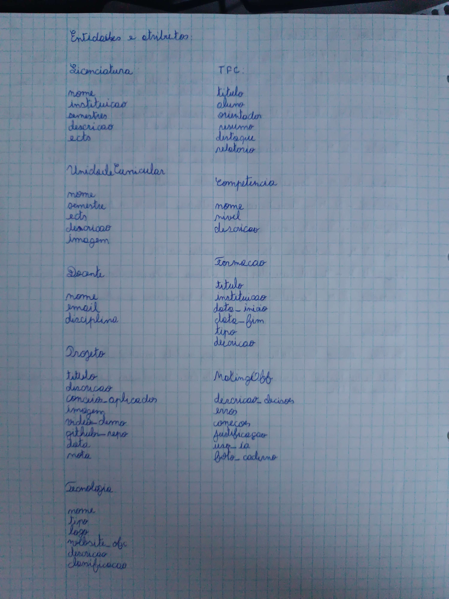
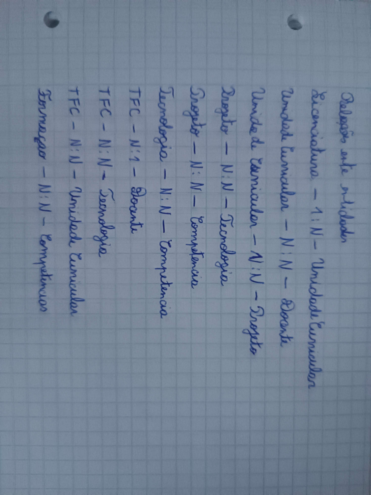
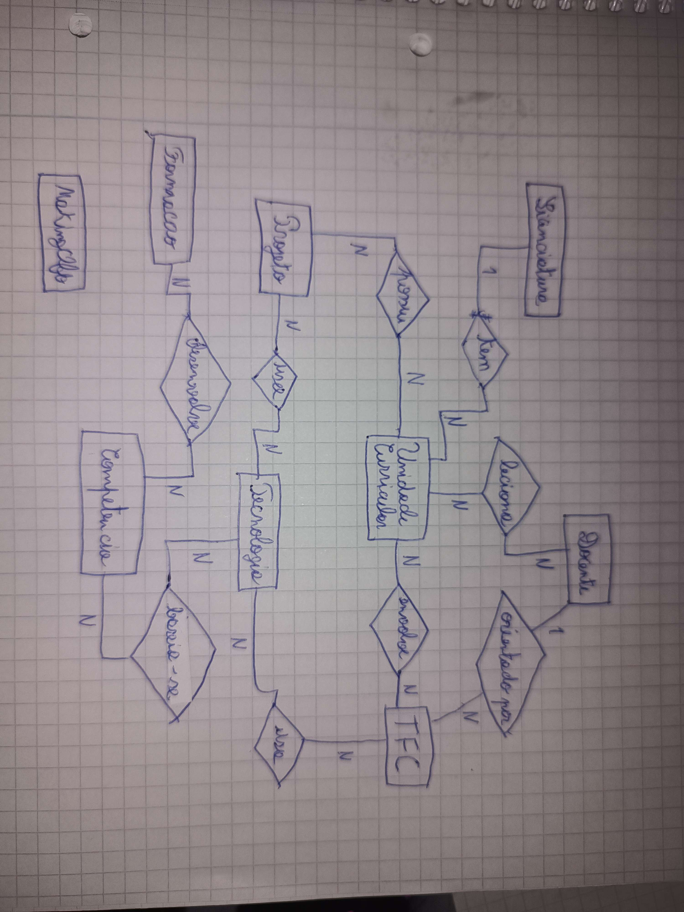

# Making Off

## Primeira versão das entidades:
.png)

---

## Versão final das entidades e atributos:

Alterações: alguns atributos do MakingOff e do Docente foram corrigidos e foram removidos os tipos dos atributos.

---

## Primeira versão das ralações entre entidades:
.png)

---

## Versão final das relações entre entidades:

Alterações: foi corrigida a relação entre UC e Projeto e foram retiradas as descrições das relações.

---

## Versão final do diagrama DER:

# Tabela Entidades

| Entidade               | Atributos                                                                          |
|------------------------|------------------------------------------------------------------------------------|
| Licenciatura           | Nome, Instituicao, Semestres, Descricao, Ects                                      |
| Unidade Curricular     | Nome, Semestre, Ects, Descricao, Imagem                                            |
| Docente                | Nome, Email, Disciplina                                                            |
| TFC                    | Título, Aluno, Orientador, Resumo, Destaque, Relatorio                             |
| Projeto                | Titulo, Descricao, Conceitos_aplicados, Imagem, Video_demo, github_repo, data, nota|
| Tecnologia             | Nome, Tipo, , Logo, Website_ofc, Descricao, Classificacao                          |
| Formacao               | Titulo, Tipo, Instituicao, Data_Inicio, Data_Fim, Descricao                        |
| Competencia            | Nome, Nivel, Descricao                                                             |
| MakingOF               | Descricao_Desisoes, Erros, Correcoes, Justificacao, Uso_IA, Foto_Caderno           |

# Tabela Relações

Entidade 1         | Relação            | Entidade 2         | Cardinalidade        |
|--------------------|--------------------|--------------------|----------------------|
| Licenciatura       | tem                | Unidade Curricular | 1 : N                |
| Unidade Curricular | é lecionada por    | Docente            | N : N                |
| Unidade Curricular | possui             | Projeto            | N : N                |
| Projeto            | Usa                | Tecnologia         | N : N                |
| Projeto            | desenvolve         | Competencia        | N : N                |
| Tecnologia         | baseia-se          | Competencia        | N : N                |
| TFC                | orientado por      | Docente            | N : 1                |
| TFC                | usa                | Tecnologia         | N : N                |
| TFC                | ebvolve            | Unidade Curricular | N : N                |
| Formacao           | desenvolve         | Competencia        | N : N                |

## FICHA 7

# Making Off - Portfólio Django

## 1. Introdução
Este projeto consiste no desenvolvimento de um portfólio académico usando o framework Django.

## 2. Dificuldades Encontradas
- Configuração dos static files (CSS)
- Migrações quando adicionava campos novos aos modelos
- Implementação do CRUD
- Integração do django-markdownify

## 3. Soluções
- Usei `` e `collectstatic`
- Aprendi a usar `null=True, blank=True` em campos novos
- Segui o padrão MVT rigorosamente
- Usei formulários ModelForm para o CRUD

## 4. Aprendizagens
- Arquitetura MVT do Django
- Relacionamentos entre modelos (ForeignKey, ManyToMany)
- Templates e URLs dinâmicas
- Gestão de ficheiros estáticos e media

## 5. Tecnologias Usadas
- **Backend**: Django 5
- **Frontend**: HTML5, CSS3
- **Base de Dados**: SQLite
- **Outros**: Git + GitHub, GitHub Codespaces, Markdownify

## 6. Conclusão
Foi um ótimo projeto para consolidar conhecimentos de Django.